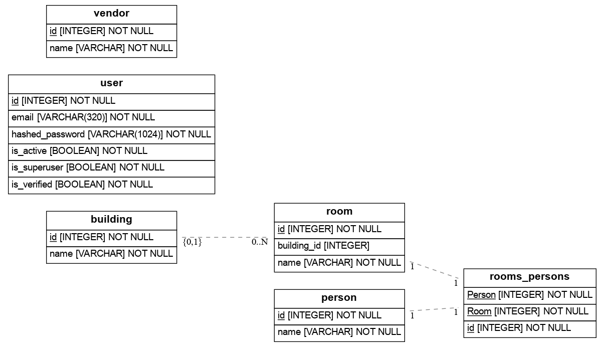

# catalog3

API для приложения учета движения оргтехники (больше ориентировано на картриджи и соответствующую оргтехнику).
Движение оргтехники это:
- покупка
- введение в эксплуатацию
- передача пользователю
- заправка/ремонт
- выведение из эксплутации.
Пользователь в свою очередь имеет географическое положение - здание-кабинет.

Стек
FastAPI 
SQLAlchemy
Postgresql
Docker

Миграции
Alembic

Регистрация и аутентификация
FastAPI Users

Тестирование
Pytest
Testcontainers

CI/CD
GitHub Actions

Интерфейс планируется FastUI

