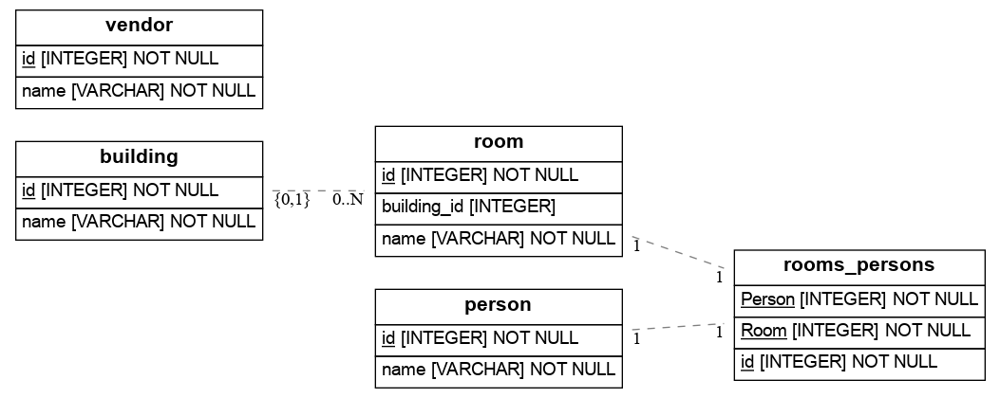

# catalog3

API для приложения учета движения картриджей/барабанов принтеров/МФУ.
Движение картриджей - это
    - покупка
    - введение в эксплуатацию
    - передача пользователю
    - заправка/ремонт
    - выведение из эксплутации.

